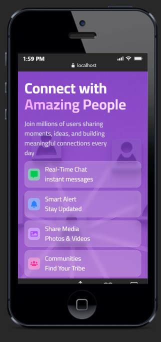
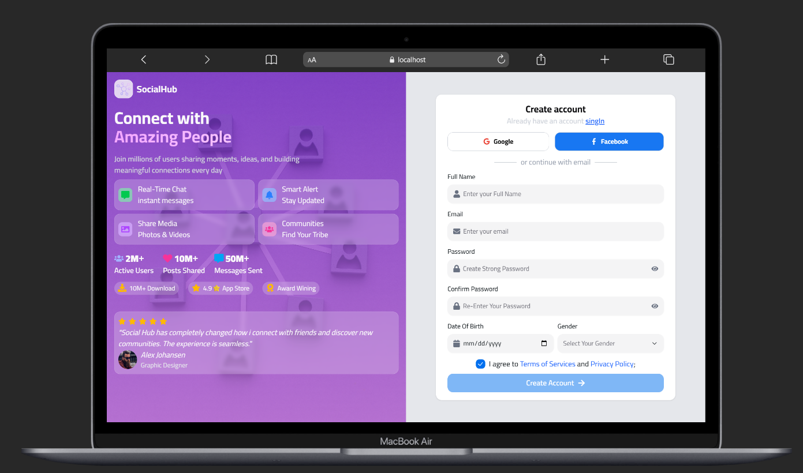
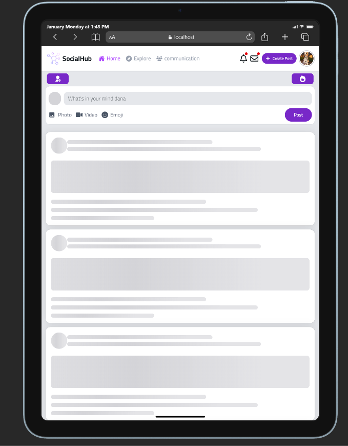
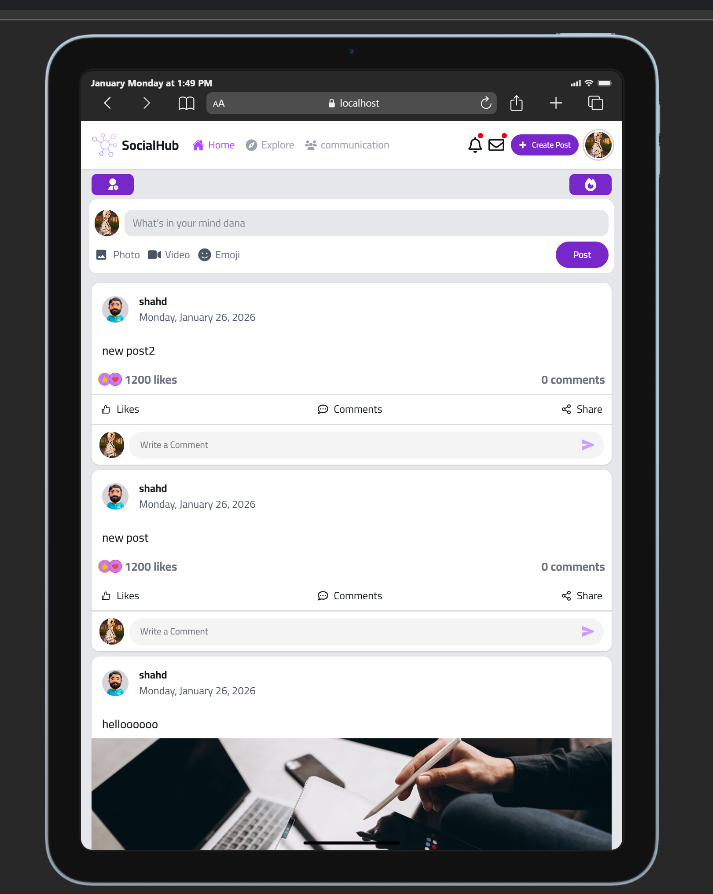
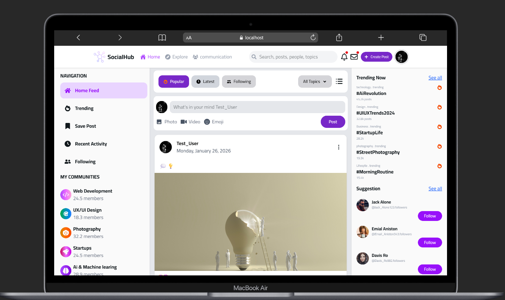
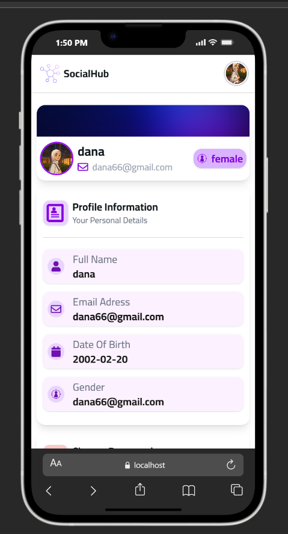
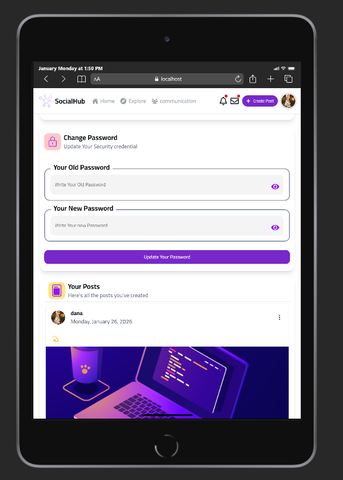
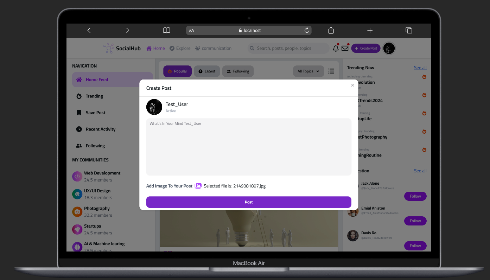
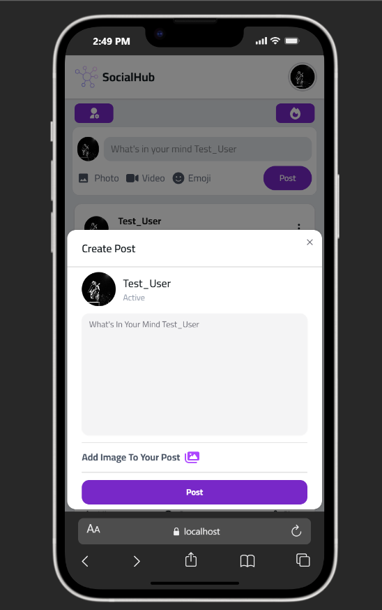

# SocialHub 🌐

<p align="center">
  
  <span style="font-size: 28px; font-weight: bold; margin-left: 10px;">
    Social Hub
  </span>
</p>


A modern, fully responsive social media platform built with React and Vite. Connect with friends, share posts, engage with comments, and explore profiles—all in one beautifully designed application.

[🌍 Live Demo](https://social-app-social-hup-app.vercel.app/) • [📦 Repository](https://github.com/danamah/Social-App-SocialHup-App.git)

</div>

---

## 📋 Description

**SocialHub** is a contemporary social media application that enables users to authenticate, create and manage posts, interact through comments, update their profiles, and explore other users' content. Built with cutting-edge web technologies, SocialHub provides a seamless and intuitive user experience with real-time data synchronization and responsive design across all devices.

---

## ✨ Features

- 🔐 **User Authentication** - Secure registration and login with token-based authentication
- ✍️ **Post Management** - Create, edit, and delete posts with ease
- 💬 **Comments & Interactions** - Engage with posts through comments and likes
- 👤 **User Profiles** - View and manage user profiles with customizable information
- 📸 **Photo Upload** - Update profile pictures and post images
- 🔄 **Real-time Data** - Fetch and sync posts and user data in real-time
- 📱 **Responsive Design** - Fully mobile-friendly interface with Tailwind CSS
- 🎨 **Beautiful UI Components** - Polished components powered by HeroUI
- 🛡️ **Form Validation** - Robust form handling with Zod validation
- 🔒 **Protected Routes** - Secure routes that require authentication
- 🎯 **Password Management** - Secure password change functionality
- 🚨 **Toast Notifications** - User-friendly notifications with react-toastify
- 🎪 **Alert Dialogs** - Confirmation and alert modals with SweetAlert2

---

## 🛠️ Tech Stack

| Category               | Technology                   |
| ---------------------- | ---------------------------- |
| **Frontend Framework** | React 18.x                   |
| **Build Tool**         | Vite 5.x                     |
| **Styling**            | Tailwind CSS 3.x             |
| **UI Components**      | HeroUI                       |
| **Routing**            | React Router                 |
| **HTTP Client**        | Axios                        |
| **Form Management**    | React Hook Form              |
| **Form Validation**    | Zod + hookform/resolvers     |
| **Icons**              | React Icons                  |
| **Notifications**      | React Toastify               |
| **Alerts**             | SweetAlert2                  |
| **Typography**         | Source Sans Pro (Cairo Font) |

---

## 📄 Pages

| Page            | Status | Description                                  |
| --------------- | ------ | -------------------------------------------- |
| NewsFeedPage    | ✅     | Main feed displaying all posts               |
| UserProfilePage | ✅     | User profile with posts and information      |
| PostDetailsPage | ✅     | Detailed view of a single post with comments |
| NotFoundPage    | ✅     | 404 error page                               |
| LoginPage       | 🔑     | User authentication login form               |
| RegisterPage    | ®️     | User registration and signup                 |

---

## 📁 Project Structure

```
src/
├── Components/
│   ├── Auth/                 # Authentication pages (Login, Register)
│   │   ├── AuthHero.jsx
│   │   ├── LoginForm.jsx
│   │   └── RegisterForm.jsx
│   ├── Cards/                # Reusable card components
│   │   ├── CardBar/
│   │   ├── CardSkeleton/     # Loading skeleton
│   │   ├── CreatePostCard/   # Post creation component
│   │   └── PostCard/         # Post display component
│   ├── Context/              # Global state management
│   │   ├── AuthContext.jsx   # Authentication state
│   │   ├── FetchAllPostsContext.jsx  # Posts state
│   │   └── UserLoggedContext.jsx     # User state
│   ├── Services/             # API integration
│   │   └── userServices.js
│   ├── Navbar/               # Navigation component
│   ├── Footer/               # Footer component
│   ├── Layouts/              # Layout components
│   ├── Pages/                # Page components
│   │   ├── NewsFeedPage
│   │   ├── UserProfilePage
│   │   ├── PostDetailsPage
│   │   └── NotFoundPage
│   ├── PostDetailsModal/     # Post details modal
│   ├── ProtectedRoutes/      # Route protection logic
│   ├── SideBars/             # Sidebar components
│   └── lib/                  # Utility functions
├── assets/
│   └── images/
├── App.jsx                   # Main app component
├── main.jsx                  # React entry point
├── hero.js                   # Hero configuration
└── index.css                 # Global styles
```

---

## 🚀 Installation & Setup

### Prerequisites

- Node.js (v18.x or higher)
- npm or yarn package manager

### Steps

1. **Clone the repository:**

   ```bash
   git clone https://github.com/danamah/Social-App-SocialHup-App.git
   cd Social-App-SocialHup-App
   ```

2. **Install dependencies:**

   ```bash
   npm install
   ```

3. **Create environment file:**
   Create a `.env.local` file in the `src/` directory with your configuration:

   ```
   VITE_API_URL=https://linked-posts.routemisr.com
   ```

4. **Start the development server:**

   ```bash
   npm run dev
   ```

   The app will open at `http://localhost:5173`

5. **Build for production:**

   ```bash
   npm run build
   ```

6. **Preview production build:**
   ```bash
   npm run preview
   ```

---

## 💻 Usage

### Getting Started

1. Navigate to the app and register a new account
2. Log in with your credentials
3. Start creating posts and exploring the feed
4. Visit user profiles to learn more about other members
5. Manage your profile picture and password in profile settings

### Main Features

- **Create a Post** - Click the post card on the NewsFeedPage to share your thoughts
- **View Post Details** - Click on any post to see full details and comments
- **Update Profile** - Go to your profile to upload a new photo and change password
- **Browse Feed** - Scroll through posts from all users on the NewsFeedPage
- **Protected Access** - Some routes require authentication (automatically enforced)

---

## 📦 Packages & Dependencies

### Core Dependencies

```json
{
  "react": "^18.x",
  "react-dom": "^18.x",
  "react-router": "latest",
  "vite": "^5.x"
}
```

### UI & Styling

- ✅ **Tailwind CSS** - Utility-first CSS framework
- ✅ **HeroUI** - Beautiful React components
- ✅ **React Icons** - Icon library
- ✅ **Cairo Font (Source Sans Pro)** - Typography

### Forms & Validation

- ✅ **React Hook Form** - Efficient form management
- ✅ **Hookform/resolvers** - Form validation resolvers
- ✅ **Zod** - TypeScript-first schema validation

### Notifications & Alerts

- ✅ **React Toastify** - Toast notifications
- ✅ **SweetAlert2** - Beautiful alert dialogs

### HTTP & API

- ✅ **Axios** - HTTP client for API requests

---

## 🔄 API Integration

This project integrates with the **Linked Posts API** (`https://linked-posts.routemisr.com`).

### Key Endpoints

- `POST /users/register` - User registration
- `POST /users/login` - User login
- `GET /users/profile-data` - Fetch logged user data
- `PUT /users/upload-photo` - Upload profile photo
- `PATCH /users/change-password` - Change password
- `GET /posts` - Fetch all posts
- `POST /posts` - Create a new post
- `DELETE /posts/:id` - Delete a post

**Note:** All authenticated endpoints require a `token` header.

---

## 🌟 Future Improvements

- 🔍 **Search Functionality** - Search posts and users
- 🔔 **Real-time Notifications** - Push notifications for interactions
- ❤️ **Enhanced Like System** - Advanced interaction metrics
- 🏷️ **Hashtags & Trending** - Support for hashtags and trending topics
- 🔗 **Share Posts** - Share posts on social media or via link
- 📱 **PWA Support** - Progressive Web App capabilities
- 🌙 **Dark Mode** - Dark theme option
- 🌐 **Internationalization** - Multi-language support
- 📊 **Analytics Dashboard** - User activity insights
- 🤝 **Follow System** - Follow/unfollow users

---

## 📸 Screenshots

_Screenshots coming soon! Add images in the following locations:_

### Login / Register Pages





### NewsFeed (iPadPro View)




### NewsFeed (Desktop View)



### User Profile




### Create Post




### Post Details Page


---

## 🤝 Contributing

Contributions are welcome! Please feel free to submit a pull request or open an issue if you find any bugs or have suggestions for improvements.

### Steps to Contribute

1. Fork the repository
2. Create a feature branch (`git checkout -b feature/AmazingFeature`)
3. Commit your changes (`git commit -m 'Add some AmazingFeature'`)
4. Push to the branch (`git push origin feature/AmazingFeature`)
5. Open a Pull Request

---

## 📧 Contact & Support

For questions, suggestions, or support, please reach out via:

- 🐙 GitHub: [@danamah](https://github.com/danamah)
- 🌐 Live Demo: [SocialHub](https://social-app-social-hup-app.vercel.app/)

---

<div align="center">

⭐ If you find this project helpful, please consider giving it a star! ⭐

Made with ❤️ by Eng. Dana Mahmoud

</div>
